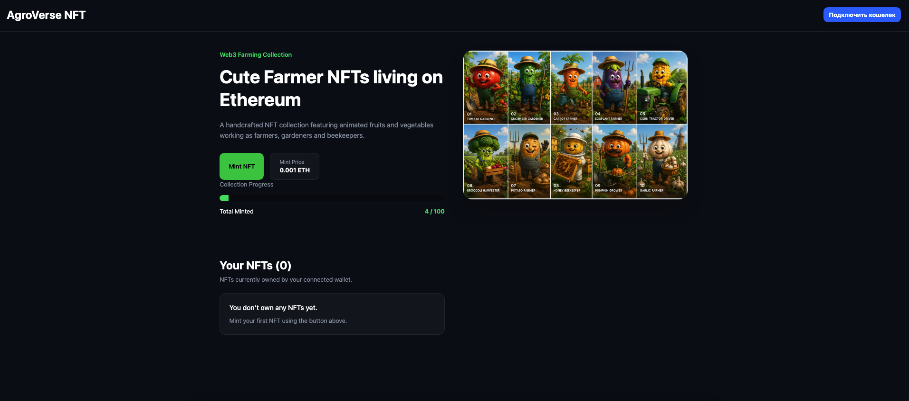
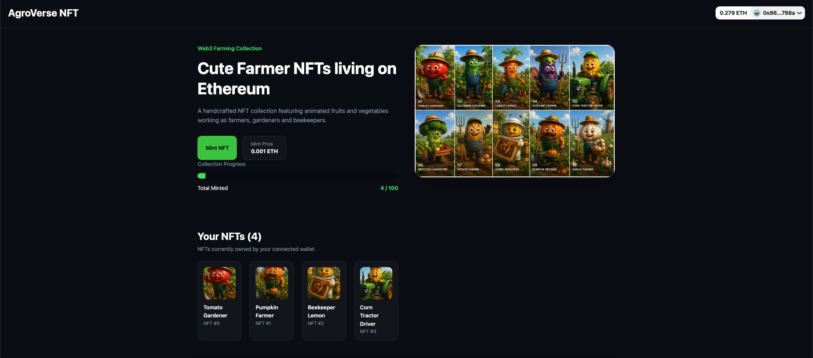
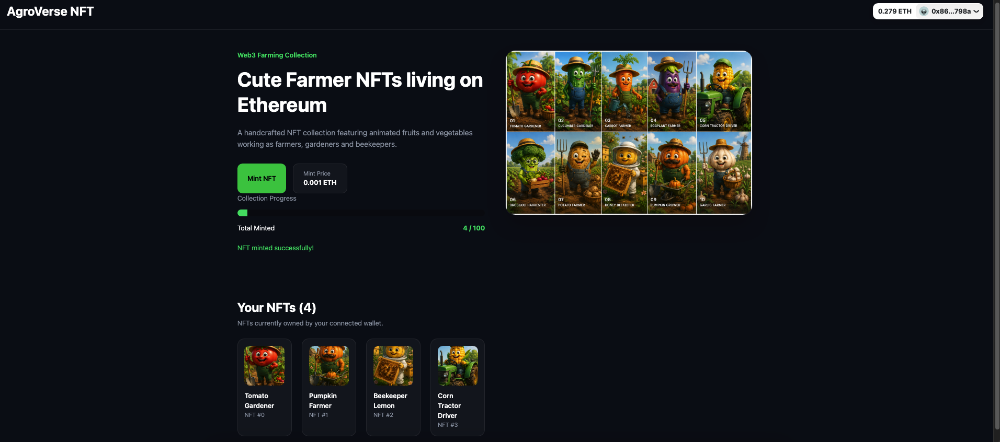

# 🌽 AgroVerse NFT

A full-stack NFT minting dApp built with Solidity, Foundry, React, Wagmi, Viem and RainbowKit.

AgroVerse NFT is a collection of cute farmer-themed NFTs deployed on Ethereum Sepolia. Users can connect their wallet, mint NFTs, track collection progress and view NFTs owned by their wallet.

---

## 🚀 Live Demo

https://agroverse-nft.vercel.app

---

## 📸 Screenshots

### Homepage



### Connected Wallet



### Owned NFTs and Mint



---

## ✨ Features

- Connect wallet with RainbowKit
- Mint NFTs on Ethereum Sepolia
- View collection progress
- Display NFTs owned by the connected wallet
- Open NFTs directly on Etherscan
- IPFS-hosted NFT images and metadata
- Responsive UI built with TailwindCSS

---

## 🛠 Tech Stack

### Smart Contracts

- Solidity
- Foundry
- OpenZeppelin

### Frontend

- React
- TypeScript
- Vite
- Wagmi
- Viem
- RainbowKit
- TailwindCSS

### Storage

- IPFS

### Network

- Ethereum Sepolia

---

## 📦 Smart Contract

**Contract Address**

```text
0x9907Ae8C54fc98A9DF75139830Cb9b18495E19Ee
```

**Etherscan**

https://sepolia.etherscan.io/address/0x9907Ae8C54fc98A9DF75139830Cb9b18495E19Ee

---

## 🌐 NFT Metadata

Metadata and images are stored on IPFS.

Example NFT metadata:

```json
{
  "name": "Tomato Gardener",
  "description": "Cute farmer NFT from AgroVerse collection",
  "image": "ipfs://..."
}
```

---

## ⚙️ Installation

Clone the repository:

```bash
git clone https://github.com/andrei-iarovoi/agroverse-nft.git
```

Install dependencies:

```bash
cd frontend
npm install
```

Run frontend locally:

```bash
npm run dev
```

---

## 🧪 Smart Contract Testing

Run Foundry tests:

```bash
forge test
```

Run formatting checks:

```bash
forge fmt --check
```

Build contracts:

```bash
forge build
```

---

## 📁 Project Structure

```text
nft-mint-dapp/
├── src/
├── script/
├── test/
├── frontend/
│   ├── src/
│   ├── public/
│   └── package.json
├── metadata/
└── README.md
```

---

## 📄 License

MIT License
